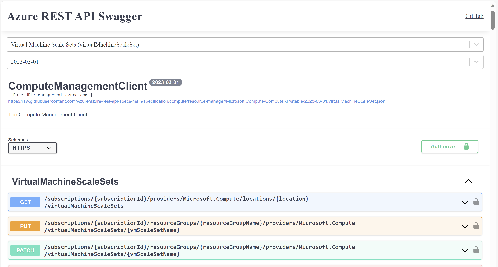
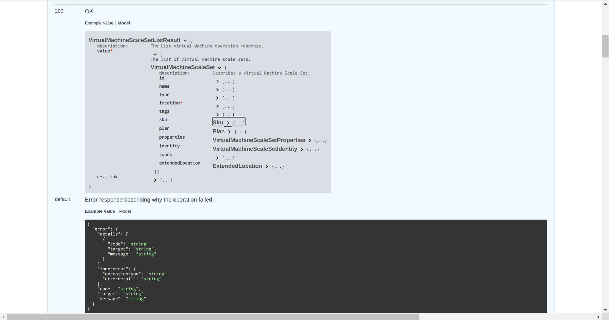

# azure-rest-api-swagger

[https://azure-rest-api-swagger.vercel.app/](https://azure-rest-api-swagger.vercel.app/)

Swagger-UI-based Azure REST API documentation generated from [official Azure OpenAPI specs](https://github.com/Azure/azure-rest-api-specs). Alternative to [official docs](https://learn.microsoft.com/en-us/rest/api/azure/). Feedback and PRs are welcome.




## Features

- interactive tree model of every ARM API's response, with field descriptions and admissible types in one place.

## TODOs

- data plane APIs
- better search bar
- support directly send requests from the webpage
- support MS specific swagger extensions

## Getting Started

First, run the development server:

```bash
npm run dev
# or
yarn dev
# or
pnpm dev
```

Open [http://localhost:3000](http://localhost:3000) with your browser to see the result.

You can start editing the page by modifying `app/page.js`. The page auto-updates as you edit the file.

## Learn More

To learn more about Next.js, take a look at the following resources:

- [Next.js Documentation](https://nextjs.org/docs) - learn about Next.js features and API.
- [Learn Next.js](https://nextjs.org/learn) - an interactive Next.js tutorial.

You can check out [the Next.js GitHub repository](https://github.com/vercel/next.js/) - your feedback and contributions are welcome!

## Deploy on Vercel

The easiest way to deploy your Next.js app is to use the [Vercel Platform](https://vercel.com/new?utm_medium=default-template&filter=next.js&utm_source=create-next-app&utm_campaign=create-next-app-readme) from the creators of Next.js.

Check out our [Next.js deployment documentation](https://nextjs.org/docs/deployment) for more details.
